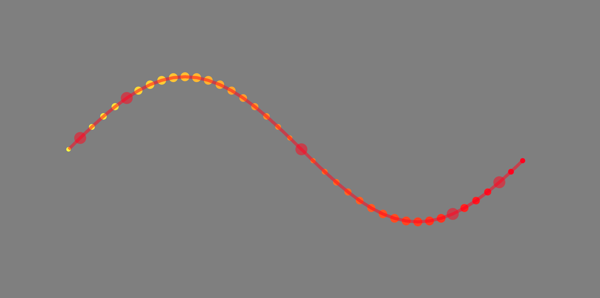
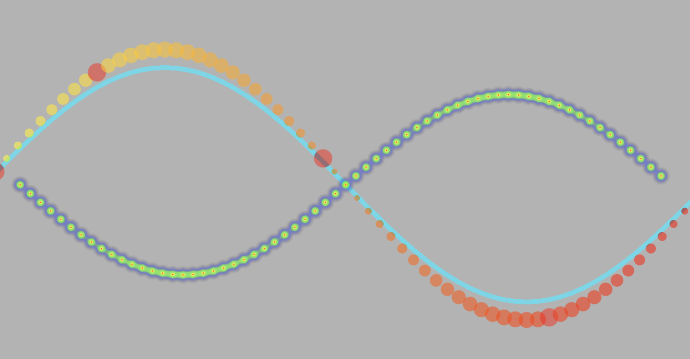

# jad-webgpu-visualization-renderer

A webgpu renderer for data visualization

## Installation

```bash
npm install jad-webgpu-visualization-renderer
```

## Usage

### 散点和轨迹渲染

```ts
import { Renderer, Scene, Points } from 'jad-webgpu-visualization-renderer'
import { PerspectiveCamera } from 'three'

const renderer = new Renderer({ canvas })
const scene = new Scene()
//you can use THREE.PerspectiveCamera or OrthographicCamera
const camera = new PerspectiveCamera(45, canvas.width / canvas.height, 0.1, 1000)
camera.position.set(0, 0, 500)

const num = 40
const pos = new Float32Array(num * 2)
const color = new Uint8Array(num * 4)
const size = new Float32Array(num)
for (let i = 0; i < num; ++i) {
	pos[2 * i] = (640 / num) * i - 320
	pos[2 * i + 1] = Math.sin(((2 * Math.PI) / num) * i) * 100
	color[i * 4 + 0] = 255
	color[i * 4 + 1] = ((num - i) / num) * 255
	color[i * 4 + 2] = 0
	color[i * 4 + 3] = 255
	size[i] = Math.abs(Math.sin(((2 * Math.PI) / num) * i)) * 15 + 15
}

//create Line model
const line = new Line({
	positions: pos,
	material: { color: [0.0, 0.0, 1, 0.5], lineWidth: 10, blending: 'normalBlending' } //optional
})

//create Points model
const points = new Points({
	positions: pos,
	colors: color, //optional
	sizes: size, //optional
	material: {
		//optional
		color: [1, 1, 0, 1],
		blending: 'normalBlending',
		size: 25,
		highlightSize: 40,
		highlightColor: [1, 0, 0, 0.5]
	}
})

scene.addModel(points)
scene.addModel(line)

renderer.render(camera, scene)

setTimeout(() => {
	//change line color after 3sec
	line.material.updateUniform('color', [1, 0, 0, 0.5])
	//highlight 1st 5th 20th and 33th point
	points.highlights([1, 5, 20, 33])
	renderer.render(camera, scene)
}, 3000)
```



### 热力数据渲染

```ts
import { Renderer, Scene, Points } from 'jad-webgpu-visualization-renderer'
import { PerspectiveCamera } from 'three'

const renderer = new Renderer({ canvas })
const scene = new Scene()
//you can use THREE.PerspectiveCamera or OrthographicCamera
const camera = new PerspectiveCamera(45, canvas.width / canvas.height, 0.1, 1000)
camera.position.set(0, 0, 500)

const num = 2000
const points = new Float32Array(num * 2)

points[0] = 0.2
points[1] = 0
points[2] = 0.5
points[3] = 0
for (let i = 2; i < num; ++i) {
	points[i * 2] = Math.random() * 600 - 300
	points[i * 2 + 1] = Math.random() * 200 - 100
}
console.log(points)

const h = new Heatmap({
	points,
	material: {
		radius: 20,
		maxHeatValue: (maxValue) => maxValue //can be number of (maxValue: number) => number
	}
})

scene.addModel(h)

renderer.render(camera, scene)
```


